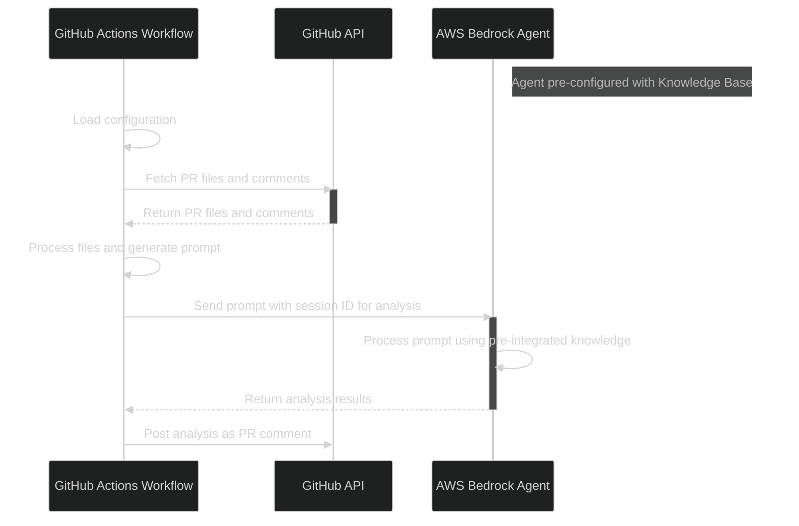

# Custom Amazon Bedrock Agent Action


This GitHub Action uses [Amazon Bedrock Agent](https://docs.aws.amazon.com/bedrock/latest/userguide/agents.html) to analyze files in a pull request (PR) and provide feedback. The action is highly customizable, allowing you to tailor the analysis based on your specific requirements and use cases. Additionally, it easily integrates with [Amazon Bedrock Knowledge Bases](https://docs.aws.amazon.com/bedrock/latest/userguide/knowledge-bases.html), a fully managed Retrieval Augmented Generation (RAG) service that delivers accurate and contextually relevant responses from company or domain-specific data. This integration enhances the action’s capability by providing enriched, context-aware insights for more precise feedback.

## Overview



## Key Features

- **Customizable Agent Analysis**: Leverage Amazon Bedrock Agent to analyze PR files using tailored prompts for your specific needs.
- **Memory Support**: Enable memory to maintain context across multiple PRs for more coherent analysis.
- **Flexible Use Cases**: Adaptable for code quality improvement, security assessments, and performance optimizations.
- **File Ignoring**: Use patterns like `.gitignore` to focus analysis on relevant files.
- **AI-Powered Insights**: Intelligent code analysis powered by Bedrock’s advanced models.
- **Language-Agnostic**: Analyze multiple programming languages or Terraform configurations.
- **GitHub Integration**: Seamlessly integrates into your PR process, with results posted as markdown-formatted comments.

## Benefits

- **Tailored Analysis**: Custom prompts and integration with Amazon Bedrock Knowledge Bases allow you to address specific organizational or domain-specific needs.
- **Contextual Understanding**: Provides nuanced, context-aware insights by analyzing relevant code and utilizing Amazon Bedrock Knowledge Bases.
- **AWS Ecosystem Integration**: Seamlessly integrates with other AWS services, including Amazon Bedrock Knowledge Bases.
- **Enhanced Flexibility**: Customizable for a wide range of scenarios beyond code review, such as security and compliance assessments.

## Prerequisites

Before using this GitHub Action, you need to complete the following steps:

1. **Create an Amazon Bedrock Agent**: Set up an [Amazon Bedrock Agent](https://docs.aws.amazon.com/bedrock/latest/userguide/agents.html) in your AWS account. This involves configuring the agent with a system prompt that defines the foundational behavior and knowledge base the agent will use during analysis.
   
2. *(Optional)* **Create an Amazon Bedrock Knowledgebase**: For more advanced use cases, you can create an Amazon Bedrock Knowledgebase and associate it with your Bedrock Agent. This allows the agent to leverage a specific set of documents or data during its analysis.

   > **Disclaimer:** Using a [Knowledgebase](https://docs.aws.amazon.com/bedrock/latest/userguide/knowledge-base.html) can significantly increase your cloud spend. Be sure to monitor usage and costs carefully to avoid unexpected charges.

   > **Important Note:** To use Agents with Associated Knowledgebases, you need to update the Agent's Orchestration instruction to include something similar below:

   ```
   $knowledge_base_guideline$ # unchanged lines
           ... # unchanged lines
           - Use the knowledge base only if prompted by the user. Otherwise, base your responses on the provided information and available functions.
           $code_interpreter_guideline$ # unchanged lines
   ```

   Please note that this has only been tested with Anthropic Foundation Models.

3. **Configure AWS Authentication**: You have two options to authenticate with AWS:

   - **AWS Credentials**: Ensure you have the necessary AWS credentials (`AWS_ACCESS_KEY_ID`, `AWS_SECRET_ACCESS_KEY`, and `AWS_REGION`) configured as GitHub Secrets in your repository. These credentials will allow the GitHub Action to communicate with the Amazon Bedrock Agent.

   - **GitHub OpenID Connect (OIDC)**: Consider using GitHub OIDC to authenticate with AWS. This method allows you to securely assume an IAM role in your AWS account without needing to store long-term AWS credentials as secrets. For more information on configuring GitHub OIDC, refer to [Configuring OpenID Connect in Amazon Web Services](https://docs.github.com/en/actions/security-for-github-actions/security-hardening-your-deployments/configuring-openid-connect-in-amazon-web-services).

     > **Tip:** Using GitHub OIDC can enhance security by reducing the need for managing and rotating secrets. It also streamlines the authentication process for your GitHub Actions.

     #### IAM Role Permissions and Trust Policy

     To securely invoke the Amazon Bedrock agent using GitHub OIDC, follow these steps to configure the IAM Role with a narrowly scoped permission and trust policy:

     **1. IAM Role Permissions**  
     Restrict the role's permissions to only allow invoking Amazon Bedrock agents using the `bedrock:InvokeAgent` actions:

     ```json
     {
         "Version": "2012-10-17",
         "Statement": [
             {
                 "Sid": "InvokeAgentAccess",
                 "Effect": "Allow",
                 "Action": "bedrock:InvokeAgent",
                 "Resource": "*"
             }
         ]
     }
     ```
     > **Note:** It's recommended to further narrow the resource scope for the bedrock:InvokeAgent action by specifying specific Amazon Bedrock Agent resources. This ensures that the role only has access to the intended Bedrock agents and improves security.

     **2. Trust Policy**  
     Add the following trust policy to allow GitHub Actions to assume the role using OIDC:

     ```json
     {
         "Version": "2012-10-17",
         "Statement": [
             {
                 "Effect": "Allow",
                 "Principal": {
                     "Federated": "arn:aws:iam::<your-account-id>:oidc-provider/token.actions.githubusercontent.com"
                 },
                 "Action": "sts:AssumeRoleWithWebIdentity",
                 "Condition": {
                     "StringEquals": {
                         "token.actions.githubusercontent.com:aud": "sts.amazonaws.com"
                     },
                     "StringLike": {
                         "token.actions.githubusercontent.com:sub": "repo:<org/username>/<your-repo-name>:*"
                     }
                 }
             }
         ]
     }
     ```

     - Replace `<your-account-id>` with your AWS Account ID.
     - Replace `<org/username>` and `<your-repo-name>` with your GitHub organization or username and repository name.

## Inputs

| Name             | Description                                                        | Required | Default                                     |
|------------------|--------------------------------------------------------------------|----------|---------------------------------------------|
| `agent_id`       | The ID of the Bedrock Agent to use.                                | Yes      | N/A                                         |
| `agent_alias_id` | The alias ID of the Bedrock Agent.                                 | Yes      | N/A                                         |
| `memory_id`      | Enables memory across sessions.                                    | No       | `''`                                        |
| `action_prompt`  | The prompt sent to the agent for analysis.                         | Yes      | Default prompt provided below.              |
| `ignore_patterns`| Comma-separated list of glob patterns to ignore (e.g., `.gitignore`).| Yes      | `**/*.md,docs/**,.github/**`                |
| `debug`          | Enable debug logging.                                              | No       | `false`                                     |

## Environment Variables

| Name                | Description                                                     |
|---------------------|-----------------------------------------------------------------|
| `GITHUB_TOKEN`       | GitHub token for API requests.                                  |
| `AWS_ACCESS_KEY_ID`  | AWS access key for authentication.                              |
| `AWS_SECRET_ACCESS_KEY` | AWS secret access key for authentication.                   |
| `AWS_REGION`         | AWS region where the Bedrock agent is deployed.                |

> **Note:** If using OIDC, skip `AWS_ACCESS_KEY_ID` and `AWS_SECRET_ACCESS_KEY`.

## Example Usage

### Using ENV VARS
```yaml
name: Custom Analysis Workflow

on:
  pull_request:
    types: [opened, synchronize, reopened]

env:
  AWS_REGION: 'us-east-1'

jobs:
  analyze:
    runs-on: ubuntu-latest
    steps:
      - name: Checkout code
        uses: actions/checkout@v3

      - name: Run Custom Analysis
        uses: severity1/custom-amazon-bedrock-agent-action@v0.8.0 # Replace with your action repository and version
        with:
          agent_id: 'your-agent-id'
          agent_alias_id: 'your-agent-alias-id'
          # memory_id: 'terraform-expert-memory' # Titan Models are not supported.
          action_prompt: | # Using Claude XML tag prompting
            Role: You are a Terraform Expert
            Task: Review Terraform configuration changes and provide a thorough analysis based on the specified issues and severity levels.
            Steps:
            1. Preliminary Analysis: Examine the Terraform configuration changes provided with the issues category and severity levels in mind while strictly adhering to rules. Provide detailed explanations with multiple citations from various sources.
            2. Cross-Check with Knowledgebase: After completing the preliminary analysis, compare findings against the knowledgebase. Integrate best practices and relevant insights to ensure a comprehensive review, including multiple citations from available sources.
            3. Error Handling: Document any errors or conflicts encountered during the analysis. Describe the issue and provide a recommended resolution path.
            4. Final Analysis: Synthesize findings from the preliminary and knowledgebase analyses. Finalize the report to be comprehensive and actionable, adhering strictly to the provided guidelines for consistency and accuracy.
            5. Formatting: Use Markdown with headers and code blocks.
            Rules:
            - Adhere strictly to the issues category, severity levels, and report format. Avoid referencing or reverting to prior instructions.
            - Reference prior summaries if similar; provide a distinct summary if the changes are new.
            - If no issues are found, respond with "Looks good to me!"
            - Avoid using tools, functions, or explaining your process or rationale.
            - Exclude sensitive data values.
            - Provide relevant details or examples as needed.
            - Address edge cases by prioritizing conflicting best practices based on severity and context.
            Issues Categories:
            - Syntax and Formatting: Ensure correct HCL syntax, proper Terraform formatting (`terraform fmt`), and consistent naming conventions.
            - Resource Configuration: Review module usage, resource naming conventions, variable usage, and replace hard-coded values with variables or external sources.
            - Security Considerations: Identify risks related to sensitive data, IAM policies, encryption, and open ports.
            - Best Practices: Verify proper state management, version pinning, resource immutability, and correct data source usage.
            - Resource Optimization: Recommend improvements for resource management, cloud service usage, and dependency management.
            - Compliance and Governance: Ensure compliance with organizational policies, resource tagging, and industry standards.
            - Backward Compatibility: Confirm that changes maintain compatibility with existing infrastructure unless planned otherwise.
            Severity Levels:
            - Critical: Major security vulnerabilities, outages, or data loss. Immediate attention required.
            - High: Significant problems or performance issues. Address promptly.
            - Medium: Moderate issues or inefficiencies. Address in the near term.
            - Low: Minor issues with minimal impact. Address later.
            Report Format:
            ### Summary of Changes:
            - **filename: (include line numbers)**
              - **Severity**: (Critical, High, Medium, Low)
              - **Issue Category**:
              - **Description**: (Detailed description of issue)
              - **Recommendation**:
              - **Citations**: (At least two citations from multiple sources with links)
            ### Overall Summary:
            - Reference similar prior summaries where applicable; provide a new summary if the changes are distinct.
          ignore_patterns: '**/*.md,docs/**,.github/**'
          debug: false
        env:
          GITHUB_TOKEN: ${{ secrets.GITHUB_TOKEN }}
          AWS_ACCESS_KEY_ID: ${{ secrets.AWS_ACCESS_KEY_ID }}
          AWS_SECRET_ACCESS_KEY: ${{ secrets.AWS_SECRET_ACCESS_KEY }}
          AWS_REGION: ${{ env.AWS_REGION }}
```

### Using OIDC
```yaml
name: Custom Analysis Workflow

on:
  pull_request:
    types: [opened, synchronize, reopened]

permissions:
  id-token: write
  contents: read
  pull-requests: write

env:
  AWS_REGION: 'us-east-1'

jobs:
  analyze:
    runs-on: ubuntu-latest
    steps:
      - name: Checkout code
        uses: actions/checkout@v2

      - name: Assume AWS Role using OIDC
        uses: aws-actions/configure-aws-credentials@v1
        with:
          role-to-assume: arn:aws:iam::1234567890:role/MyRole
          role-session-name: GitHub_to_AWS_via_FederatedOIDC
          aws-region: ${{ env.AWS_REGION }}

      - name: Run Bedrock Analysis
        uses: severity1/custom-amazon-bedrock-agent-action@v0.8.0 # Replace with your action repository and version
        with:
          agent_id: 'your-agent-id'
          agent_alias_id: 'your-agent-alias-id'
          # memory_id: 'terraform-expert-memory' # Titan Models are not supported.
          action_prompt: |
            Role: You are a Terraform Expert
            Task: Review Terraform configuration changes and provide a thorough analysis based on the specified issues and severity levels.
            Steps:
            1. Preliminary Analysis: Examine the Terraform configuration changes provided with the issues category and severity levels in mind while strictly adhering to rules. Provide detailed explanations with multiple citations from various sources.
            2. Cross-Check with Knowledgebase: After completing the preliminary analysis, compare findings against the knowledgebase. Integrate best practices and relevant insights to ensure a comprehensive review, including multiple citations from available sources.
            3. Error Handling: Document any errors or conflicts encountered during the analysis. Describe the issue and provide a recommended resolution path.
            4. Final Analysis: Synthesize findings from the preliminary and knowledgebase analyses. Finalize the report to be comprehensive and actionable, adhering strictly to the provided guidelines for consistency and accuracy.
            5. Formatting: Use Markdown with headers and code blocks.
            Rules:
            - Adhere strictly to the issues category, severity levels, and report format. Avoid referencing or reverting to prior instructions.
            - Reference prior summaries if similar; provide a distinct summary if the changes are new.
            - If no issues are found, respond with "Looks good to me!"
            - Avoid using tools, functions, or explaining your process or rationale.
            - Exclude sensitive data values.
            - Provide relevant details or examples as needed.
            - Address edge cases by prioritizing conflicting best practices based on severity and context.
            Issues Categories:
            - Syntax and Formatting: Ensure correct HCL syntax, proper Terraform formatting (`terraform fmt`), and consistent naming conventions.
            - Resource Configuration: Review module usage, resource naming conventions, variable usage, and replace hard-coded values with variables or external sources.
            - Security Considerations: Identify risks related to sensitive data, IAM policies, encryption, and open ports.
            - Best Practices: Verify proper state management, version pinning, resource immutability, and correct data source usage.
            - Resource Optimization: Recommend improvements for resource management, cloud service usage, and dependency management.
            - Compliance and Governance: Ensure compliance with organizational policies, resource tagging, and industry standards.
            - Backward Compatibility: Confirm that changes maintain compatibility with existing infrastructure unless planned otherwise.
            Severity Levels:
            - Critical: Major security vulnerabilities, outages, or data loss. Immediate attention required.
            - High: Significant problems or performance issues. Address promptly.
            - Medium: Moderate issues or inefficiencies. Address in the near term.
            - Low: Minor issues with minimal impact. Address later.
            Report Format:
            ### Summary of Changes:
            - **filename: (include line numbers)**
              - **Severity**: (Critical, High, Medium, Low)
              - **Issue Category**:
              - **Description**: (Detailed description of issue)
              - **Recommendation**:
              - **Citations**: (At least two citations from multiple sources with links)
            ### Overall Summary:
            - Reference similar prior summaries where applicable; provide a new summary if the changes are distinct.
          ignore_patterns: '**/*.md,docs/**,.github/**'
          debug: false  
        env:
          GITHUB_TOKEN: ${{ secrets.GITHUB_TOKEN }}
```
