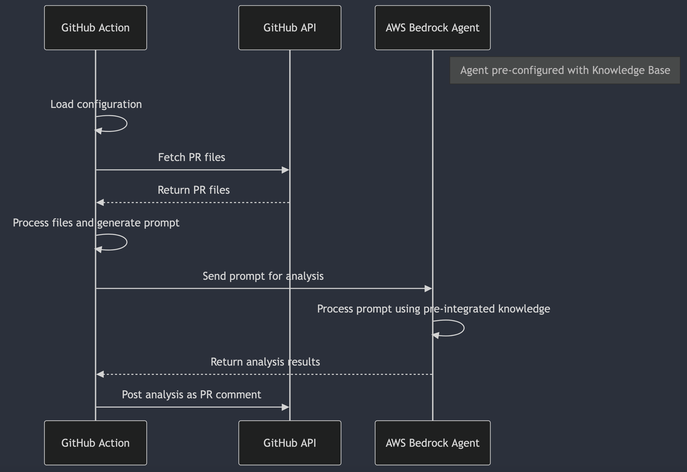

# Custom Amazon Bedrock Agent Action


This GitHub Action leverages [Amazon Bedrock Agent](https://docs.aws.amazon.com/bedrock/latest/userguide/agents.html) to analyze files in a pull request (PR) and provide feedback. It's designed to be customizable, allowing you to tailor the analysis based on specific requirements and use cases.



## Advantages
- **Tailored Analysis**: You can configure the Bedrock Agent with specific prompts tailored to your organizational standards, compliance needs, or particular security concerns. This flexibility allows for a more customized and relevant analysis compared to generic tools.

- **Contextual Understanding**: The Bedrock Agent, leveraging advanced AI models, can provide nuanced and context-aware insights. This can include understanding code in the context of broader infrastructure changes or patterns that might not be easily captured by static analysis tools.

- **Language-Specific Insights**: The action allows you to define language-specific prompts, providing specialized analysis for various programming languages or Terraform configurations, which might not be as easily configurable in static tools.

- **Integration with AWS Ecosystem**: For teams already using AWS and Bedrock, integrating with the Bedrock Agent might offer a smoother workflow. This integration allows for leveraging existing AWS services and security configurations.

- **Flexibility and Customization**: The action can be adapted for a wide range of use cases beyond just Terraform, making it useful for various code review and security assessment scenarios. Users can provide custom [knowledgebases](https://docs.aws.amazon.com/bedrock/latest/userguide/knowledge-base.html) to the Bedrock Agent, enhancing its ability to provide specific recommendations and insights.

## Features
- **Customizable Agent Analysis**: Leverage Amazon Bedrock Agent's capabilities to analyze PR files according to your specific requirements, benefiting from advanced language models and customizable prompts.
- **Flexible Use Cases**: Adapt the action for various use cases such as code quality improvement, security assessments, performance optimizations, and more, tailored to your project's needs.
- **File Ignoring**: Define patterns to ignore certain files or directories, similar to `.gitignore`, allowing for focused analysis on relevant files.
- **Integration with Amazon Bedrock Knowledgebases**: Enhance the agent's capabilities by incorporating domain-specific knowledge through [Amazon Bedrock Knowledgebases](https://docs.aws.amazon.com/bedrock/latest/userguide/knowledge-base.html), enabling more accurate and context-aware analyses.
- **AI-Powered Insights**: Benefit from AI-driven code analysis, providing intelligent suggestions and identifying potential issues that might be missed by traditional static analysis tools.
- **Language-Agnostic Analysis**: Perform insightful analysis across multiple programming languages, benefiting from the broad knowledge base of the underlying language models.
- **Customizable Prompts**: Tailor the analysis focus with custom prompts, allowing you to address specific concerns or areas of interest in your codebase.
- **Integration with GitHub Workflows**: Seamlessly incorporate advanced AI-powered code review into your existing GitHub pull request processes, enhancing your development lifecycle.
- **Markdown-Formatted Comments**: Posts analysis results as a well-formatted comment on the PR.

## Prerequisites

Before using this GitHub Action, you need to complete the following steps:

1. **Create an Amazon Bedrock Agent**: Set up an [Amazon Bedrock Agent](https://docs.aws.amazon.com/bedrock/latest/userguide/agents.html) in your AWS account. This involves configuring the agent with a system prompt that defines the foundational behavior and knowledge base the agent will use during analysis.
   
2. *(Optional)* **Create an Amazon Bedrock Knowledgebase**: For more advanced use cases, you can create an Amazon Bedrock Knowledgebase and associate it with your Bedrock Agent. This allows the agent to leverage a specific set of documents or data during its analysis.

   > **Disclaimer:** Using a [Knowledgebase]((https://docs.aws.amazon.com/bedrock/latest/userguide/knowledge-base.html)) can significantly increase your cloud spend. Be sure to monitor usage and costs carefully to avoid unexpected charges.

3. **Configure AWS Authentication**: 

   You have two options to authenticate with AWS:

   - **AWS Credentials**: Ensure you have the necessary AWS credentials (`AWS_ACCESS_KEY_ID`, `AWS_SECRET_ACCESS_KEY`, and `AWS_REGION`) configured as GitHub Secrets in your repository. These credentials will allow the GitHub Action to communicate with the Amazon Bedrock Agent.

   - **GitHub OpenID Connect (OIDC)**: Consider using GitHub OIDC to authenticate with AWS. This method allows you to securely assume an IAM role in your AWS account without needing to store long-term AWS credentials as secrets. For more information on configuring GitHub OIDC, refer to [Configuring OpenID Connect in Amazon Web Services](https://docs.github.com/en/actions/security-for-github-actions/security-hardening-your-deployments/configuring-openid-connect-in-amazon-web-services).

   > **Tip:** Using GitHub OIDC can enhance security by reducing the need for managing and rotating secrets. It also streamlines the authentication process for your GitHub Actions.

## Inputs

| Name                      | Description                                                                     | Required | Default                                                                                       |
|---------------------------|---------------------------------------------------------------------------------|----------|-----------------------------------------------------------------------------------------------|
| `ignore_patterns`         | Comma-separated list of glob patterns to ignore (similar to `.gitignore`).      | true     | `**/*.md,docs/**`                                                                             |
| `action_prompt`           | The prompt to send to the Bedrock Agent for analysis.                           | true     | `Given the relevant code changes above, provide a detailed analysis including potential improvements and security considerations.` |
| `agent_id`                | The ID of the Bedrock Agent to use.                                             | true     | N/A                                                                                           |
| `agent_alias_id`          | The alias ID of the Bedrock Agent to use.                                       | true     | N/A                                                                                           |
| `debug`                   | Enable debug logs for troubleshooting and detailed output.                     | false    | `false`                                                                                       |


## Environment Variables

This action requires the following environment variables:

| Name           | Description                                                       |
|----------------|-------------------------------------------------------------------|
| `GITHUB_TOKEN` | GitHub token for authenticating API requests (automatically set). |
| `AWS_ACCESS_KEY_ID` | AWS access key ID for Bedrock API authentication.            |
| `AWS_SECRET_ACCESS_KEY` | AWS secret access key for Bedrock API authentication.    |
| `AWS_REGION`   | AWS region where the Bedrock agent is deployed.                   |

> **Note:** If you are using GitHub OIDC for authentication, you do not need to set `AWS_ACCESS_KEY_ID` and `AWS_SECRET_ACCESS_KEY` as environment variables. Instead, configure your GitHub Actions workflow to assume the appropriate IAM role.

## Example Usage

### Using ENV VARS
```yaml
name: Custom Analysis Workflow

on:
  pull_request:
    types: [opened, synchronize, reopened]

jobs:
  analyze:
    runs-on: ubuntu-latest
    steps:
      - name: Checkout code
        uses: actions/checkout@v3

      - name: Run Custom Analysis
        uses: severity1/custom-amazon-bedrock-agent-action@v0.5.0 # Replace with your action repository and version
        with:
          agent_id: 'your-agent-id'
          agent_alias_id: 'your-agent-alias-id'
          action_prompt: |
            You are a Terraform expert. Review the provided Terraform configuration changes and conduct a detailed analysis based on the following Issues Categories and Severity Levels while adhering to the Guidelines outlined below.

            Guidelines:
            - Do not use tools or functions.
            - Do not explain how you will perform the analysis.

            Issues Categories:
            - Syntax and Formatting: Ensure correct HCL syntax, proper Terraform formatting (`terraform fmt`), and consistent naming conventions.
            - Resource Configuration: Check module usage, resource naming conventions, variable usage, and replace hard-coded values with variables or external data sources.
            - Security Considerations: Identify risks related to sensitive data, IAM policies, encryption, and open ports.
            - Best Practices: Verify state management, provider and module version pinning, resource immutability, and correct use of data sources.
            - Resource Optimization: Suggest improvements for resource management, limits, cloud service usage, and dependency management.
            - Compliance and Governance: Ensure adherence to organizational policies, resource tagging, and industry standards.
            - Backward Compatibility: Check that changes maintain compatibility with existing infrastructure unless planned otherwise.

            Severity Levels:
            - Critical: Significant security vulnerabilities, major outages, or data loss. Immediate attention required.
            - High: Serious problems or performance degradation. Address as soon as possible.
            - Medium: Moderate problems or inefficiencies. Address in the near term.
            - Low: Minor issues with little impact. Address later.

            Provide a concise list of key changes and any issues found, with recommendations, using the format below:

            Format Start

            **Summary of Changes:**

            - **filename1: (line number(s))**
              - **Severity:** (Critical, High, Medium, Low)
              - **Issue Category:**
              - **Summary of Issue:**
              - **Recommendation:**

            - **filename2: (line number(s))**
              - **Severity:** (Critical, High, Medium, Low)
              - **Issue Category:**
              - **Summary of Issue:**
              - **Recommendation:**

            **Overall Summary:**

            Format End

            If no issues are found, simply respond with "Looks good to me!"
          ignore_patterns: '**/*.md,docs/**,.github/**'
          debug: false
        env:
          GITHUB_TOKEN: ${{ secrets.GITHUB_TOKEN }}
          AWS_ACCESS_KEY_ID: ${{ secrets.AWS_ACCESS_KEY_ID }}
          AWS_SECRET_ACCESS_KEY: ${{ secrets.AWS_SECRET_ACCESS_KEY }}
          AWS_REGION: 'us-east-1'
```

### Using OIDC
```yaml
name: Custom Analysis Workflow

on:
  pull_request:
    types: [opened, synchronize, reopened]

jobs:
  analyze:
    runs-on: ubuntu-latest
    steps:
      - name: Checkout code
        uses: actions/checkout@v2

      - name: Assume AWS Role using OIDC
        uses: aws-actions/configure-aws-credentials@v1
        with:
          role-to-assume: arn:aws:iam::123456789012:role/MyGitHubActionsRole
          aws-region: ${{ env.AWS_REGION }}

      - name: Run Bedrock Analysis
        uses: severity1/custom-amazon-bedrock-agent-action@v0.5.0 # Replace with your action repository and version
        with:
          agent_id: 'your-agent-id'
          agent_alias_id: 'your-agent-alias-id'
          action_prompt: |
            You are a Terraform expert. Review the provided Terraform configuration changes and conduct a detailed analysis based on the following Issues Categories and Severity Levels while adhering to the Guidelines outlined below.

            Guidelines:
            - Do not use tools or functions.
            - Do not explain how you will perform the analysis.

            Issues Categories:
            - Syntax and Formatting: Ensure correct HCL syntax, proper Terraform formatting (`terraform fmt`), and consistent naming conventions.
            - Resource Configuration: Check module usage, resource naming conventions, variable usage, and replace hard-coded values with variables or external data sources.
            - Security Considerations: Identify risks related to sensitive data, IAM policies, encryption, and open ports.
            - Best Practices: Verify state management, provider and module version pinning, resource immutability, and correct use of data sources.
            - Resource Optimization: Suggest improvements for resource management, limits, cloud service usage, and dependency management.
            - Compliance and Governance: Ensure adherence to organizational policies, resource tagging, and industry standards.
            - Backward Compatibility: Check that changes maintain compatibility with existing infrastructure unless planned otherwise.

            Severity Levels:
            - Critical: Significant security vulnerabilities, major outages, or data loss. Immediate attention required.
            - High: Serious problems or performance degradation. Address as soon as possible.
            - Medium: Moderate problems or inefficiencies. Address in the near term.
            - Low: Minor issues with little impact. Address later.

            Provide a concise list of key changes and any issues found, with recommendations, using the format below:

            Format Start

            **Summary of Changes:**

            - **filename1: (line number(s))**
              - **Severity:** (Critical, High, Medium, Low)
              - **Issue Category:**
              - **Summary of Issue:**
              - **Recommendation:**

            - **filename2: (line number(s))**
              - **Severity:** (Critical, High, Medium, Low)
              - **Issue Category:**
              - **Summary of Issue:**
              - **Recommendation:**

            **Overall Summary:**

            Format End

            If no issues are found, simply respond with "Looks good to me!"
          ignore_patterns: '**/*.md,docs/**,.github/**'
          debug: false  
        env:
          AWS_REGION: 'us-east-1'  # Replace with your AWS region
```